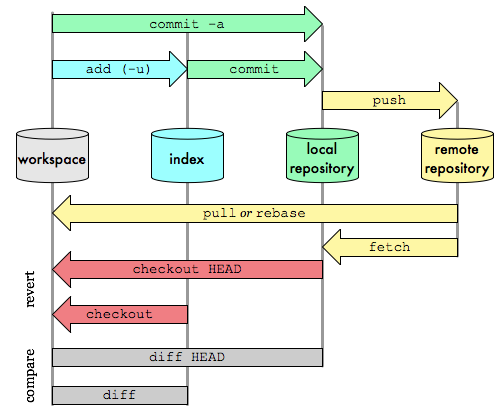
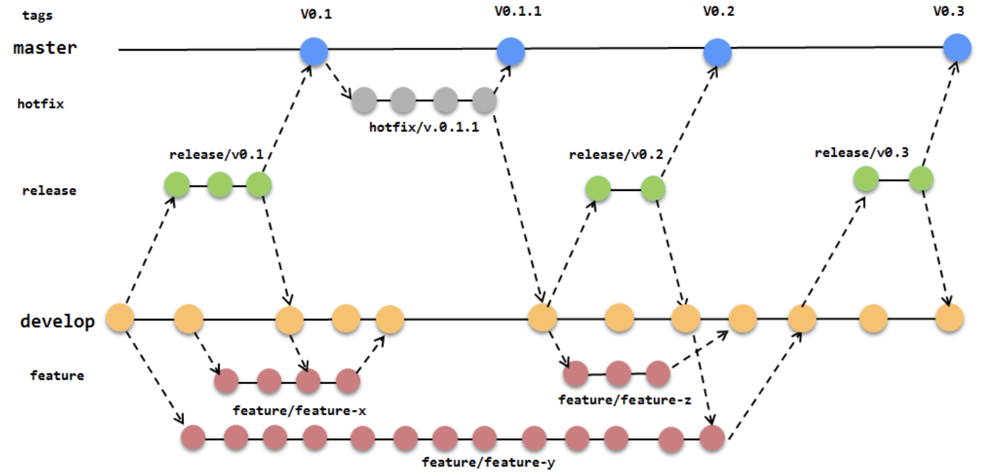

# Version Control with Git




## Git book

[The entire Pro Git book](https://git-scm.com/book/en/v2)

## Git Glossary

__The [Git Glossary](https://git-scm.com/docs/gitglossary/en)__ is very useful

## Terms

In Git, the __working tree__,  also known as the __working directory__
or __working copy__ refers to the directory on your local machine where
you  have cloned or checked out a Git repository. It is the place where you
can see and modify the actual files that make up the project.

When you clone a Git repository or switch to a specific branch,
Git creates a working tree that contains a snapshot of the project's
files and directories as they exist in that particular state of the
repository. These files are the ones you can edit, add, or delete
to make changes to your project.

The __working tree__ is separate from the Git repository itself, which is
located in the hidden `.git` directory at the root of the project.
The `.git` directory stores all the necessary information about the
project's history, branches, commits, and configuration.

The typical Git workflow involves making changes to the files in
the __working tree__, and once you're satisfied with the modifications,
you __stage__ the changes and create a commit. The commit permanently
records the changes you made to the repository's history.

It's important to note that the __working tree__ is distinct from the
__staging area__ (also known as the __index__). The staging area is
where you prepare changes to be committed. After staging changes,
you can review them and ensure they are accurate before creating a commit.

To summarize, the __working tree__ in Git is the area on your local machine
where you can interact with the actual project files and make changes
before committing them to the repository's history.

## Git Configuration

|Change Configuration|Command|
|--------------------|-------|
|Sets up Git with your name|```git config --global user.name "John Reynolds"```|
|Sets up Git with your email|```git config --global user.email "jjmreynolds@gmail.com"```|
|Makes sure that Git output is colored|```git config --global color.ui auto```|
|Displays the original state in a conflict|```git config --global merge.conflictstyle diff3```|
|Display configuration options|```git config --list```|
|Edit Global Settings|```git config --global -e```|

## Bash commands

|Description of Command|Command|
|--------------------|-------|
|Used to list files and directories|```ls```|
|Used to create a new directory|```mkdir```|
|Used to change directories|```cd```|
|Used to remove files and directories|```rm```|
|Used print current directory|```pwd```|

## git version

## git init
Initialized empty Git repository

* [Initializing a Repository in an Existing Directory](https://git-scm.com/book/en/v2/Git-Basics-Getting-a-Git-Repository#Initializing-a-Repository-in-an-Existing-Directory)
* [git init docs](https://git-scm.com/docs/git-init)
* [git init Tutorial](https://www.atlassian.com/git/tutorials/setting-up-a-repository)

## git clone
```bash
git clone https://github.com/udacity/course-git-blog-project
git clone https://github.com/libgit2/libgit2 mylibgit
```

* The git clone command is used to create an identical copy of an existing repository.

```bash
git clone <path-to-repository-to-clone>
```

* This command takes the path to an existing repository
by default will create a directory with the same name as the repository.
* can be given a second argument that will be used as the name of the directory
will create the new repository inside of the current working directory


* [Cloning an Existing Repository](https://git-scm.com/book/en/v2/Git-Basics-Getting-a-Git-Repository#Cloning-an-Existing-Repository)
* [git clone docs](https://git-scm.com/docs/git-clone)
* [git clone Tutorial](https://www.atlassian.com/git/tutorials/setting-up-a-repository)

## .gitignore

To recap, the .gitignore file is used to tell Git about the files that
Git should not track. This file should be placed in the same directory
that the .git directory is in.


* [GitHub ignore files](https://github.com/github/gitignore)
* [Ignoring files](https://git-scm.com/book/en/v2/Git-Basics-Recording-Changes-to-the-Repository#Ignoring-Files)
* [gitignore](https://git-scm.com/docs/gitignore#_pattern_format)
* [Ignoring files](https://help.github.com/articles/ignoring-files/)
* [gitignore.io](https://www.gitignore.io/)

## git remote repository

Repository reference

`git remote -v`

## Remove repository reference

`git remote rm origin`

## Git Log

abbreviated stats for each commit

```bash
git log --oneline             # One line summary of commits   
git log --oneline  --reverse  # Reversed ne line summary of commits   
git log --patch -2
git log --stat
git log --pretty=oneline
git log --pretty=[short|full|fuller]
git log --oneline --decorate
git log --graph --oneline
git log --oneline --decorate --graph --all
```

The `git log --stat --oneline` command provides a concise and summarized 
view of the commit history in a Git repository. It displays each commit 
as a one-liner along with a summary of the changes introduced by that 
commit.

## Git Status

__Always run Git Status__

```
git status
```

### git status -s


```
git status -s
```

The `git status -s` command is a short and concise way to view the
status of your Git repository in a simplified and easy-to-read format.
It provides a summary of the changes between the current state of your repository's __working tree__ and the __staging area__.

When you run `git status -s`, you will see output that looks like this:

```
 M file1.txt
MM file2.txt
A  file3.txt
?? new_file.txt
```

The status output is organized into columns:

1. The __first column__ represents the status of the __staging area__.
2. The __second column__ represents the status of the __working tree__.

Here's the meaning of the possible status codes:

- `??`: Untracked files - Files that are present in the working tree
but not yet tracked by Git (not added to the staging area).

- `A`: New file addition - A new file has been added to the staging area.

- `M`: File modification - A file has been modified in the working tree,
and the changes are staged and ready to be committed.

- `D`: File deletion - A file has been deleted in the working tree,
and the deletion is staged and ready to be committed.

- `R`: File rename - A file has been renamed in the working tree,
and the rename is staged and ready to be committed.

- `C`: File copy - A file has been copied in the working tree,
and the copy is staged and ready to be committed.

- `U`: Conflict - A merge conflict exists in the file between the branch
you are on and the branch you are merging or rebasing.

The absence of any letter in the first column indicates that the file's
status in the staging area has not changed since the last commit.

The absence of any letter in the second column indicates that the file's
status in the working tree has not changed since the last commit.

##  git ls-files

The git ls-files command lists the files that are tracked by Git.
This includes files that are in the index, as well as files that are
in the working tree but not in the index.

```
git ls-files

```

Here are some of the most commonly used options for git ls-files:

|Option|Effect|
|------|------|
|-c | Show the file mode.|
|-z | Show the filenames verbatim.|
|-i | Show only ignored files.|
|--stage | Show the stage information for each file.|
|--unmerged | Show unmerged files.|
|--deleted | Show deleted files.|
|--others | Show files that are not tracked by Git.|


## git ls-tree

The `git ls-tree` command is used to display the content of a specific
Git tree object. In Git, a tree object represents a directory or a
subdirectory within the repository, and it stores references to other
tree objects or blob objects (files) along with their associated metadata.

The basic syntax of the `git ls-tree` command is as follows:

```bash
git ls-tree [<commit>] [<path>]
```

- `<commit>`: Optional. The commit hash or reference to the commit that
contains the tree object you want to list. If not specified, it
defaults to the current commit (HEAD).

- `<path>`: Optional. The path to a specific subdirectory or file
within the tree object. If provided, the command will display the
contents of the tree at the specified path. If omitted, it shows the
entire tree object.

Let's explore some examples:

1. To list the contents of the current tree (current commit):

```bash
git ls-tree HEAD
```

2. To list the contents of a tree in a specific commit:

```bash
git ls-tree <commit-hash>
```

3. To list the contents of a subdirectory within a tree:

```bash
git ls-tree HEAD path/to/subdirectory
```

The output of the `git ls-tree` command displays information about
each entry in the tree. The format of the output is:

```
<mode> <type> <object>	<file/path>
```

- `<mode>`: The file mode of the entry, which represents the
permissions and object type
(e.g., 100644 for a regular file, 040000 for a subdirectory).

- `<type>`: The type of the entry, which can be "blob" for a file
or "tree" for a subdirectory.

- `<object>`: The SHA-1 hash of the object (either blob or tree)
associated with the entry.

- `<file/path>`: The relative path to the file or subdirectory
within the tree.

The `git ls-tree` command is particularly useful for inspecting the
contents of a tree object in Git, such as when you need to verify
the files and directories present in a specific commit or tree.
It is often used in combination with other Git commands to examine
the repository's history and track changes to files and directories
over time.

## Git Add

The git add command is used to move files from the Working Directory to the Staging Index.

```bash
git add <file1> <file2> … <fileN>
git add .
```

* Takes a space-separated list of file names
* Alternatively, the period . can be used in place of a list of files
to tell Git to add the current directory (and all nested files)
* `git reset`remove every thing from staging
* `git reset HEAD -- <file>` remove single file


## Git Show

The `git show` command is used to display information about a specific
Git object, such as a commit, tag, or tree. It provides a detailed view
of the changes introduced by the specified object and presents
information about the object's metadata.

The basic syntax of the `git show` command is as follows:

```bash
git show [<object>]
```

- `<object>`: The object you want to show. It can be a commit hash,
tag name, branch name, or any other valid Git object reference.

Here are some common uses of the `git show` command:

1. **Show commit information:**
   To view the details of a specific commit, you can use its commit hash:

   ```bash
   git show <commit-hash>
   ```

   This will display information about the commit, including the
   author, committer, commit date, and commit message. Additionally,
   it shows the changes introduced by that commit, displaying the diff
   of the changes for each file modified in the commit.

2. **Show tag information:**
   To view the details of a specific tag, you can use the tag name:

   ```bash
   git show <tag-name>
   ```

   This will display information about the tag, such as the tagger's
   name, tag date, and the commit associated with the tag.
   It also shows the changes introduced by the commit that the
   tag points to.

3. **Show tree information:**
   To view the contents of a specific tree object, you can use its
   tree hash:

   ```bash
   git show <tree-hash>
   ```

   This will display the details of the tree object, including the
   mode, type (tree or blob), and the SHA-1 hash of each entry
   (file or subdirectory) within the tree.

4. **Show annotated tag information:**
   To view the details of an annotated tag (a tag with additional
   metadata like a message), you can use the tag name with the `-s` option:

   ```bash
   git show -s <tag-name>
   ```

   This will show the tagger's name, email, tag date, and the
   annotation message associated with the tag.

The `git show` command is a powerful tool for inspecting and
understanding Git objects and their changes. It is particularly useful
for reviewing commit history, examining specific changes introduced
by commits or tags, and understanding the content of tree objects in
the repository.

## Git Stash
the stash command is used to temporarily store changes that are not
ready to be committed. It allows you to save your work in progress,
such as modifications to tracked files and staged changes, without
creating a commit. The changes are saved in a "stash," which is a
stack-like storage area where you can push and pop changes.

The basic usage of the git stash command is as follows:
```
git stash
```

By running this command, Git will save the modifications in the
working tree and staging area (if any) to a new stash entry.
The working directory will then be reverted to the state of the last
commit, effectively cleaning up any uncommitted changes.

The git stash command is handy in several scenarios:

1. Temporary context switch: When you need to switch to a different
branch to work on something else but don't want to commit the
unfinished work, you can stash the changes and then switch branches.
1. Pulling changes: Before pulling changes from a remote repository,
you can stash your local changes to avoid conflicts.
1. Experimenting: If you want to experiment with different changes in
your working tree without committing them yet, you can stash the
current changes and apply them later if needed.

Once you have stashed your changes, you can use other stash-related
commands to manage your stash entries:

* git stash list: Displays a list of all stash entries.
* git stash apply: Applies the most recent stash entry
(top of the stash stack) to your working tree and staging area without
removing it from the stash.
* git stash pop: Applies the most recent stash entry and removes it
from the stash stack.
* git stash drop: Removes a specific stash entry from the stash stack.
* git stash clear: Removes all stash entries from the stash stack.

## Git Staged Files
List files in the staging area

```git ls-files```

## Git Commit

The ```git commit``` command takes files from the Staging Index and
saves them in the repository.

* Will open the code editor that is specified in your configuration

Inside the code editor:

* A commit message must be supplied
* Lines that start with a # are comments and will not be recorded
* Save the file after adding a commit message
* Close the editor to make the commit
* Then, use ```git log``` to review the commit you just made!

### Standard commit message

A standard commit message structure typically consists of a header and
an optional body. The header provides a concise summary of the commit,
while the body provides additional details and context. Here's an
example of a standard commit message structure:

```
<type>: <subject>

<body>
```

Let's break down each component:

1. `<type>`: The type of the commit. It can be one of the following:

   - **feat**: A new feature
   - **fix**: A bug fix
   - **docs**: Documentation changes
   - **style**: Code style changes (e.g., formatting)
   - **refactor**: Code refactoring (without adding new features or
   fixing bugs)
   - **test**: Adding or modifying tests
   - **chore**: Other changes that don't fit into the above categories
   (e.g., build scripts, tooling)

2. `<subject>`: A brief and descriptive summary of the commit. It should
start with a capital letter and not end with a period.

3. `<body>` (optional): Additional information about the commit.
This section can provide more context, explain the reasoning behind
the changes, and include any relevant details.

It's worth mentioning that different projects and teams may have their
own conventions for commit messages. The above structure is a commonly
used format, but it's not a strict requirement.
It's important to follow the conventions established within your project
or team for consistency and clarity.

[Git Udacity's Commit Style](https://udacity.github.io/git-styleguide/)


## Git Difftool

Will use ```Winmerge```

To see the changes between the staging area and the working tree
for all modified files:

```git diff```

If you have already staged some changes and want to see what you've
staged so far, you can:

```
git diff --staged
```

## Git Diff

The ```git diff``` command can be used to see changes that have been
made but haven't been committed, yet.

* The files that have been modified
* The location of the lines that have been added/removed
* The actual changes that have been made

Various ways to check your working tree

|command|effect|
|-------|------|
|`git diff`|Changes in the working tree not yet staged for the next commit|
|`git diff --cached`|Changes between the index and your last  commit;<br>what you would be committing if you run git commit <br>without -a option|
|`git diff HEAD`|Changes in the working tree since your last commit;<br> what you would be committing if you run git commit -a|

[git diff](https://git-scm.com/docs/git-diff)


## Git Tag

The command we will be using to interact with the repository's tags is the ```git tag``` command

```bash
git tag -a v1.0
git tag -a v1.4 -m "my version 1.4"
```

__In the command above (git tag -a v1.0) the -a flag is used. This
flag tells Git to create an annotated flag. If you don't provide
the flag (i.e. git tag v1.0) then it'll create what's called a lightweight tag.__

___Annotated tags are recommended because they include a lot of extra
information such as:___

* The person who made the tag
* The date the tag was made
* A message for the tag

__Always use annotated tags.__


__Verify Tag__

After saving and quitting the editor, nothing is displayed on the
command line. So how do we know that a tag was actually added to the
project? If you type out just ```git tag```, it will display all tags
that are in the repository.

__Git Log's --decorate Flag__

As you've learned, git log is a pretty powerful tool for letting us
check out a repository's commits. We've already looked at a couple of
its flags, but it's time to add a new one to our tool belt.
The --decorate flag will show us some details that are hidden from
the default view.

```git log --decorate ```

__Deleting A Tag__

A Git tag can be deleted with the ```-d``` flag (for delete!) and the
name of the tag:


```bash
git tag -delete v1.0
git tag -d v1.0
```


__Push all tags to server__
If you have a lot of tags that you want to push up at once, you can
also use the --tags option to the git push command. This will transfer
all of your tags to the remote server that are not already there.

```bash
git push --tags
git push origin --tags
```
__View remote tags__

```bash
git ls-remote --tags origin
git ls-remote --tags origin
```

__Adding A Tag To A Past__

Provide the SHA of the commit you want to tag

```bash
git tag -a v1.0 a87984
```

* [Git Basics - Tagging](https://git-scm.com/book/en/v2/Git-Basics-Tagging)
* [Git Tag](https://git-scm.com/docs/git-tag)


## Git Branch

A Git branch is used to separate work. This tactic is commonly used
when new features are in development but need to be kept distinct until
ready for general release.

Can be used to:
* List all branch names in the repository
* Create new branches
* Delete branches


## Create A Branch

|&nbsp;|&nbsp;|
|------|------|
|```git branch sidebar```|To create a branch, all you have  to do is <br/>use git branch and provide it the name of the<br/> branch you want it to create|
|```git branch```|To list the branches, I use the  git branch command <br/>with no arguments.|

```bash
git branch -v
git branch --merged
git branch --nomerged
```

## Git Checkout

To switch between branches, we need to use Git's checkout command.

|&nbsp;|&nbsp;|
|------|------|
|```git checkout sidebar```|Command duplicates the master to the new branch|


Running this command will:

* Remove all files and directories from the Working Directory that Git is tracking
    * files that Git tracks are stored in the repository, so nothing is lost
* Go into the repository and pull out all of the files and directories
of the commit that the branch points to

__Branches In The Log__

```git log --oneline --decorate```

## Restore a file

The `git restore` command is used to restore files in your working tree
to a previous state. It allows you to undo changes made to files,
revert modifications, or even discard uncommitted changes and restore
them to the state they were in at a specific commit or in the
staging area.

The basic syntax of the `git restore` command is as follows:

```bash
git restore <file-path>
```

This will restore the specified file in the working tree to the version
found in the __staging area__. Any changes made to the file since the
last `git add` (staging) will be discarded.

You can also use `git restore` with additional options to restore files
from different sources:

1. **Restore a file to a specific commit:**

   ```bash
   git restore --source=<commit> <file-path>
   ```

   This command restores the specified file to the version found in the
   given commit. The changes made to the file since that commit will
   be discarded.

2. **Restore a file to a specific branch or commit reference:**

   ```bash
   git restore --source=<branch/commit> --staged <file-path>
   ```

   This command restores the specified file to the version found in
   the specified branch or commit. The restored version will be added
   to the staging area, allowing you to create a new commit with
   the restored changes.

3. **Restore all files in the working tree to a specific commit:**

   ```bash
   git restore --source=<commit> .
   ```

   This command restores all files in the working tree to the versions
   found in the given commit. This effectively reverts the entire
   working tree to the state it was in at that commit.

It's important to note that `git restore` is used to work with files in
the __working tree__ and the __staging area____. It does not affect
commits in the repository's history. If you want to undo a commit and
remove it from the history, you should use commands like
`git reset`, `git revert`, or `git cherry-pick`.

Be cautious when using `git restore`, especially with the `--source`
option, as it discards changes in the working tree and cannot be undone.
It is recommended to create a backup or use Git's branching and tagging
features before performing any major restoration actions.

## Delete A Branch

```bash
git branch -d sidebar

# to list all branches
$ git branch

# to create a new "footer-fix" branch
$ git branch footer-fix

# to delete the "footer-fix" branch
$ git branch -d footer-fix
```

This command is used to:
* List out local branches
* Create new branches
* Remove branches


* [Git Branching - Basic Branching and Merging](https://git-scm.com/book/en/v2/Git-Branching-Basic-Branching-and-Merging)
* [Learn Git Branching](http://learngitbranching.js.org/)
* [Git Branching Tutorial](https://www.atlassian.com/git/tutorials/using-branches)


## Git Merge

[Refer to Coursera Video][] on merging and [merge conflicts][]

The git merge command is used to combine Git branches:

```bash
git merge <name-of-branch-to-merge-in>
```
To see log and history + graph of merge

```bash
git log --graph --oneline
```

To abort the current merge:

```bash
git merge --abort
```


When a merge happens, Git will:
* Look at the branches that it's going to merge
* Look back along the branch's history to find a single commit that
both branches have in their commit history
* Combine the lines of code that were changed on the separate branches
together makes a commit to record the merge

__When we merge, we're merging some other branch into the current
(checked-out) branch. We're not merging two branches into a new branch.
We're not merging the current branch into the other branch.__

----
* It's very important to know which branch you're on when you're about
to merge branches together.
    * Remember that making a merge makes a commit.

If you make a merge on the wrong branch, use this command to undo the merge:

```bash
git reset --hard HEAD^
```

Make sure to include the ^ character! It's a known as a "Relative Commit Reference" and indicates "the parent commit".

----

The git merge command is used to combine branches in Git:

```bash
git merge <other-branch>
```

There are two types of merges:

* Fast-forward merge – the branch being merged in must be ahead of the
checked out branch.
    * The checked out branch's pointer will just be moved forward to
    point to the same commit as the other branch.
* The regular type of merge
    * two divergent branches are combined
    * a merge commit is created


* [Basic Merging](https://git-scm.com/book/en/v2/Git-Branching-Basic-Branching-and-Merging#Basic-Merging)
* [git-merge](https://git-scm.com/docs/git-merge)
* [git merge](https://www.atlassian.com/git/tutorials/git-merge)

[Refer to Coursera Video]:./videos/merge.mp4
[merge conflicts]:./videos/merge_conflicts.mp4

----

__Merge Conflict__

A merge conflict will happen when the exact same line(s) are changed
in separate branches

A merge conflict happens when the same line or lines have been changed
on different branches that are being merged. Git will pause mid-merge
telling you that there is a conflict and will tell you in what file or
files the conflict occurred. To resolve the conflict in a file:
* Locate and remove all lines with merge conflict indicators
* Determine what to keep
* Save the file(s)
* Stage the file(s)
* Make a commit
Be careful that a file might have merge conflicts in multiple parts
of the file, so make sure you check the entire file for merge conflict
indicators - a quick search for <<< should help you locate all of them.


* [Basic Merge Conflicts](https://git-scm.com/book/en/v2/Git-Branching-Basic-Branching-and-Merging#Basic-Merge-Conflicts)
* [How Conflicts Are Presented](https://git-scm.com/docs/git-merge#_how_conflicts_are_presented)


## Changing The Last Commit

```bash
$ git commit --amend
```

If your Working Directory is clean  then running ```git commit --amend``` will let you provide a new commit message. Your code editor will open up and display the original commit message. Just fix a misspelling or completely reword it! Then save it and close the editor to lock in the new commit message.

## Add Forgotten Files To Commit
Alternatively, ```git commit --amend``` will let you include files
(or changes to files) you might've forgotten to include. Let's say
you've updated the color of all navigation links across your entire
website. You committed that change and thought you were done.
But then you discovered that a special nav link buried deep on a
page doesn't have the new color. You could just make a new commit that
updates the color for that one link, but that would have two
back-to-back commits that do practically the exact
same thing (change link colors).

Instead, you can amend the last commit (the one that updated the color
of all of the other links) to include this forgotten one.
To do get the forgotten link included, just:

* Edit the file(s)
* Save the file(s)
* Stage the file(s)
* run ```git commit --amend```

So you'd make changes to the necessary CSS and/or HTML files to get the
forgotten link styled correctly, then you'd save all of the files that
were modified, then you'd use git add to stage all of the modified files
(just as if you were going to make a new commit!), but then you'd run
```git commit --amend``` to update the most-recent commit instead of
creating a new one.

## Undo local changes

[Undo Possibilities][]

* When you make a change, but have not yet staged it, you can undo your
work.
1. Confirm that the file is unstaged by running ```git status```
1. Choose an option and undo your changes:
    * overwrite local changes ```git checkout -- <file>```
    * To save local changes so you can reuse them later ```git stash```
    * To discard local changes to all files, permanently ```git reset --hard```

## Undo staged local changes

[Undo Possibilities][]

* If you added a file to staging, you can undo it.
1. Confirm that the file is staged (that you used git add <file>) by
running ```git status```
1. Choose an option and undo your changes:
    * To unstage the file but keep your changes
    ```git restore --staged <file>```
    * To unstage everything but keep your changes ```git reset```
    * To unstage the file to current commit (HEAD)
    ```git reset HEAD <file>```
    * To discard all local changes, but save them for later
    ```git stash```
    * To discard everything permanently ```git reset --hard```

[Undo Possibilities]:https://docs.gitlab.com/ee/topics/git/numerous_undo_possibilities_in_git/#when-you-can-undo-changes

## Git Revert

the ```git revert``` command is used to reverse a previously made commit:

```bash
git revert HEAD
git revert <SHA-of-commit-to-revert>
```

This command:
* Will undo the changes that were made by the provided commit
* Creates a new commit to record the change


* [git-revert](https://git-scm.com/docs/git-revert)
* [git revert](https://www.atlassian.com/git/tutorials/undoing-changes)


## Reset vs Revert
At first glance, resetting might seem coincidentally close to reverting,
 but they are actually quite different. Reverting creates a new commit
 that reverts or undoes a previous commit. Resetting, on the other hand,
 erases commits!

⚠️ __Resetting Is Dangerous__ ⚠️

_You've got to be careful with Git's resetting capabilities.
This is one of the few commands that lets you erase commits from the
repository. If a commit is no longer in the repository,
then its content is gone._

_To alleviate the stress a bit, **Git does keep track of everything
for about 30 days** before it completely erases anything. To access
this content, you'll need to use the ```git reflog``` command.
Check out these links for more info:

* [git-reflog](https://git-scm.com/docs/git-reflog)
* [Rewriting History](https://www.atlassian.com/git/tutorials/rewriting-history)
* [reflog, your safety net](http://gitready.com/intermediate/2009/02/09/reflog-your-safety-net.html)


## Remote

```bash
git remote -v
```

## Creating a github repository

[Create repository](https://help.github.com/en/github/getting-started-with-github/create-a-repo)

The preferred method of starting a repository is to create the github
repository in github and then clone it locally. it's best to generate
the .ignore in the github repository it does give you that option.


## Adding an existing project to GitHub

```bash
echo "# MIT-Introductory-Mechanics" >> README.md
git init
git add README.md
git commit -m "first commit"
git remote add origin https://github.com/JonnyRed/MIT-Introductory-Mechanics.git
git push -u origin main
```

## Deleting a repository
1. On GitHub.com, navigate to the main page of the repository.
1. Under your repository name, click Settings.
1. Under Danger Zone, click Delete this repository.
1. Read the warnings.
1. To verify that you're deleting the correct repository, type the name of the repository you want to delete.